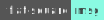
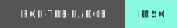

# playing with badges from shields.io

## experiments:
### static links
static link two-tone:


static link one-tone (with spaces):


### styling






```fish
for l in flat flat-square plastic for-the-badge social
  badge $l msg :8AFAE2 @$l > $l.svg
end
```

### logo
https://shields.io/docs/logos
- they host a few icons: https://github.com/badges/shields/tree/master/logo
- find more: https://simpleicons.org/?q=github
- static link: 
- my svg logo: 

- test: 
- test no collor: 

Making an svg from webp:
```fish
convert a.webp a.png
inkscape a.png --export-type=svg
```

## install and use
```sh
npm i -g badge-maker
badge tk-label tk-message :blue @flat > tk-badge.svg
# then put  in a readme
```
